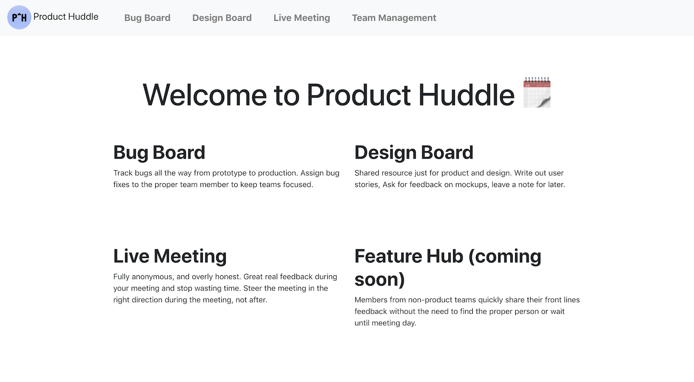
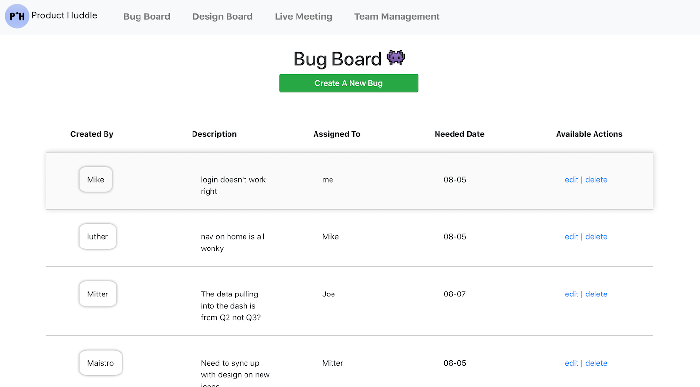
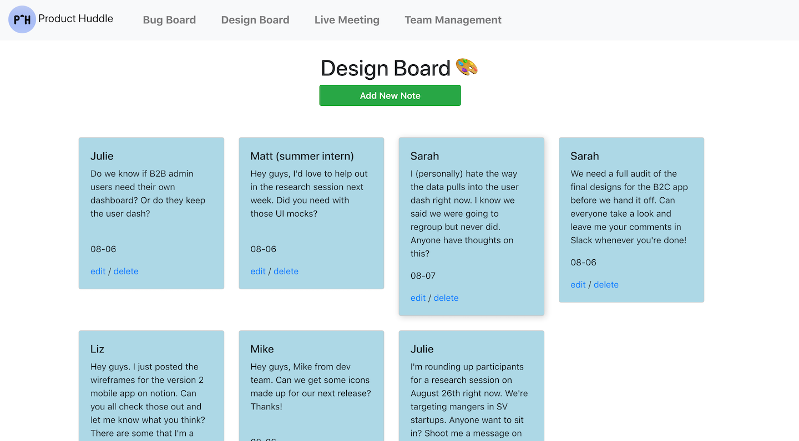
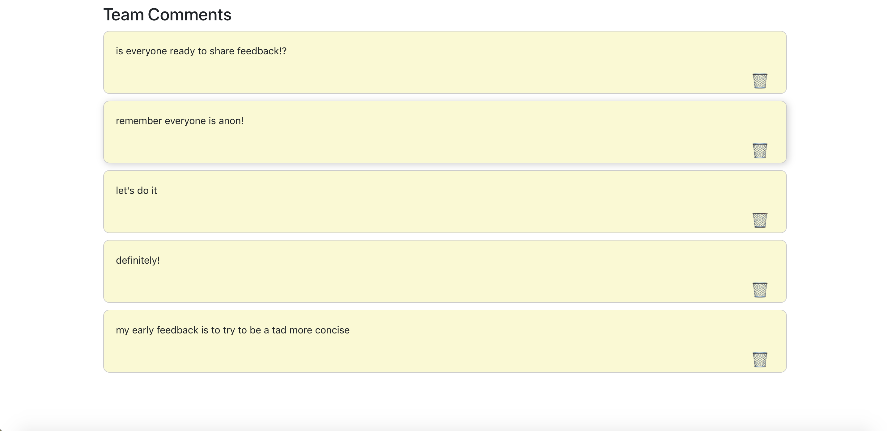

Created with [Create React App](https://github.com/facebook/create-react-app).

# Product Huddle

Product Huddle is a project designed to consider a recurring problem in the product development landscape. How do you encourange product consensus across entire organizations, not just product and development teams? 

## What's inside?

### Bug Board

Track software bugs across the organization.

### Design Board

Unified design hub for ux and product teams to post about design changes, write user stories, brainstorm about where to go next.

### Live Meeting

Fully anonymous feedback hub to be used during remote meetings. Team members post comments and the team can respond, directing the meeting where it really needs to go.

### Made With

- Mongo db
- Express 
- React
- Node.js

### Roadmap

* Feature Request Board
* Auth
* Team Management
* Filtering 

## Available Scripts

In the project directory, you can run:

### `npm start`

Runs the app in the development mode. 
Open [http://localhost:3000](http://localhost:3000) to view it in the browser.

The page will reload if you make edits. 
You will also see any lint errors in the console.

